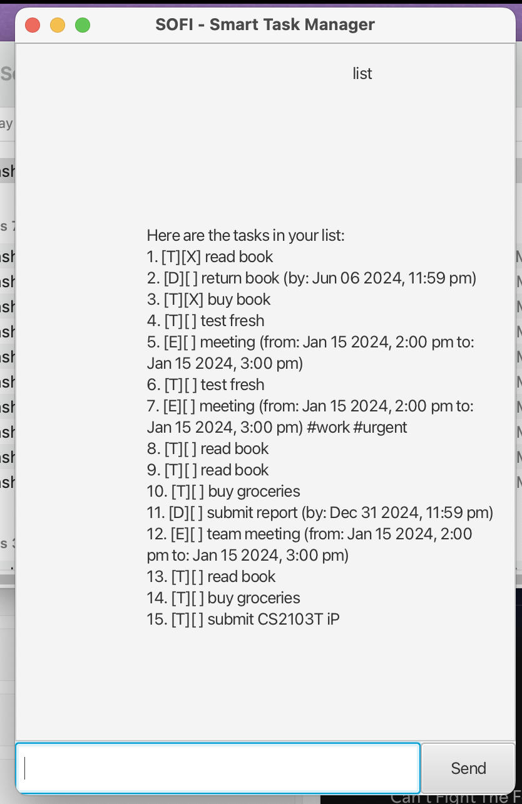

# SOFI - Smart Task Manager



**SOFI** (Smart Organizer for Intelligent Tasks) is a powerful task management application that helps you organize and track your daily tasks, deadlines, and events. Built with Java and JavaFX, SOFI provides both command-line and graphical user interfaces for maximum flexibility.

## Features

- ✅ **Task Management**: Create and manage todos, deadlines, and events
- 🏷️ **Tagging System**: Organize tasks with custom tags
- 🔍 **Smart Search**: Find tasks quickly with keyword search
- 💾 **Data Persistence**: Automatic saving and loading of tasks
- 🎨 **Dual Interface**: Command-line and GUI versions available
- 🛡️ **Error Handling**: Graceful handling of errors and data corruption

## Quick Start

1. **Download the JAR file** from the [Releases](https://github.com/Jaredee123/ip/releases) page
2. **Run the application**:
   ```bash
   java -jar sofi.jar
   ```
3. **Or build from source**:
   ```bash
   ./gradlew run
   ```

### Interface Options

- **GUI Mode** (default): Launches the JavaFX graphical interface
- **CLI Mode**: Switch to command-line interface by modifying `build.gradle`

## Installation

### Prerequisites

- **JDK 17** or higher
- **Gradle** (included via wrapper)

### Setup Instructions

1. **Clone the repository**:

   ```bash
   git clone https://github.com/Jaredee123/ip.git
   cd ip
   ```

2. **Build the project**:

   ```bash
   ./gradlew build
   ```

3. **Run the application**:
   ```bash
   ./gradlew run
   ```

## Usage

### Key Commands

- `todo DESCRIPTION` - Add a simple task
- `deadline DESCRIPTION /by TIME` - Add a task with deadline
- `event DESCRIPTION /from START /to END` - Add a scheduled event
- `list` - View all tasks
- `find KEYWORD` - Search for tasks
- `tag NUMBER TAG` - Add tags to organize tasks
- `bye` - Exit the application

**📖 For detailed command reference, see the [User Guide](docs/README.md)**

### Example Session

```
Hello! I'm SOFI
What can I do for you?

> todo Complete project proposal
Got it. I've added this task:
   [T][ ] Complete project proposal
Now you have 1 task(s) in the list.

> deadline Submit report /by 2024-12-31
Got it. I've added this task:
   [D][ ] Submit report (by: Dec 31 2024, 11:59 pm)
Now you have 2 task(s) in the list.

> tag 1 work
Nice! I've tagged this task with #work:
   [T][ ] Complete project proposal #work

> list
Here are the tasks in your list:
1. [T][ ] Complete project proposal #work
2. [D][ ] Submit report (by: Dec 31 2024, 11:59 pm)

> bye
Bye. Hope to see you again soon!
```

## Project Structure

```
ip/
├── src/
│   ├── main/
│   │   ├── java/
│   │   │   ├── sofi/
│   │   │   │   ├── SOFI.java          # Main application class
│   │   │   │   ├── Launcher.java      # GUI launcher
│   │   │   │   ├── MainApp.java       # JavaFX application
│   │   │   │   ├── MainWindow.java    # GUI controller
│   │   │   │   ├── DialogBox.java     # Chat dialog component
│   │   │   │   ├── Parser.java        # Command parser
│   │   │   │   ├── Ui.java            # User interface
│   │   │   │   ├── Task.java          # Base task class
│   │   │   │   ├── Todo.java          # Todo task
│   │   │   │   ├── Deadline.java      # Deadline task
│   │   │   │   ├── Event.java         # Event task
│   │   │   │   ├── TaskList.java      # Task collection
│   │   │   │   ├── Storage.java       # Data persistence
│   │   │   │   └── SofiException.java # Custom exception
│   │   │   └── ...
│   │   └── resources/
│   │       ├── images/                # GUI images
│   │       └── view/                  # FXML files
│   └── test/
│       └── java/                      # Unit tests
├── docs/
│   ├── README.md                      # User guide
│   └── Ui.png                         # Screenshot
├── data/
│   └── sofi.txt                       # Task data file
└── build.gradle                       # Build configuration
```

## Development

### Running Tests

```bash
./gradlew test
```

### Building JAR

```bash
./gradlew shadowJar
```

### Code Quality

The project includes comprehensive error handling, input validation, and follows Java best practices.

## Documentation

- **[📖 User Guide](docs/README.md)** - Comprehensive command reference and usage instructions
- **[🌐 Live Documentation](https://jaredee123.github.io/ip/)** - GitHub Pages documentation
- **[📦 Download JAR](https://github.com/Jaredee123/ip/releases)** - Ready-to-run application

## Contributing

1. Fork the repository
2. Create a feature branch
3. Make your changes
4. Add tests if applicable
5. Submit a pull request

## License

This project is part of an educational exercise and is available for learning purposes.

## Acknowledgments

- Built as part of the CS2103T Software Engineering course
- Inspired by the need for efficient task management
- Thanks to the Java and JavaFX communities for excellent tooling

---

**SOFI - Your intelligent task management companion** 🤖

_Keep organized, stay productive, and never miss a deadline again!_
