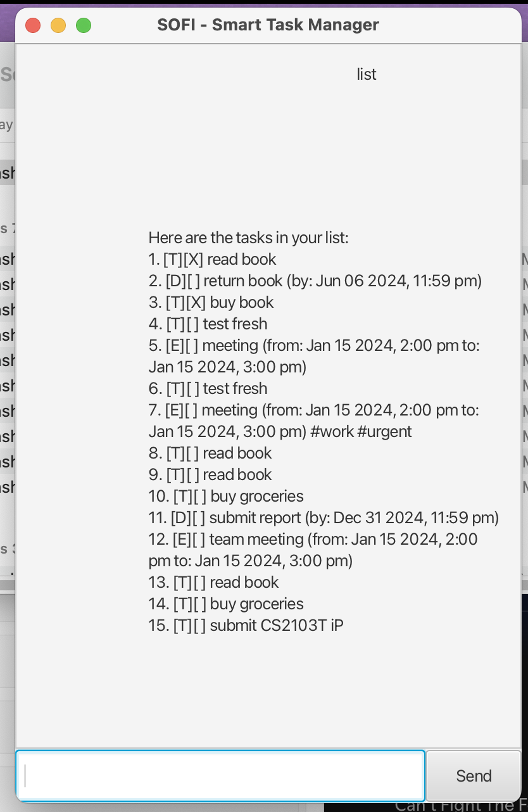

# SOFI User Guide



**SOFI** (Smart Organizer for Intelligent Tasks) is a powerful task management application that helps you organize and track your daily tasks, deadlines, and events. Whether you're managing personal projects or professional responsibilities, SOFI provides an intuitive interface to keep you organized and productive.

> **📋 Project Information**: For installation, setup, and project details, see the [main README](../README.md)

## Quick Start

1. **Launch SOFI**:
   - **JAR file**: `java -jar sofi.jar` (recommended)
   - **From source**: `./gradlew run`
2. **Add your first task**: Type `todo Complete project proposal`
3. **View your tasks**: Type `list` to see all your tasks
4. **Exit**: Type `bye` when you're done

## Features

### :information_source: Notes about the command format:

- Words in **UPPER_CASE** are the parameters to be supplied by the user.

  - e.g. in `todo DESCRIPTION`, DESCRIPTION is a parameter which can be used as `todo read book`.

- Items in square brackets are optional.

  - e.g `deadline DESCRIPTION /by TIME` can be used as `deadline submit report /by Friday` or `deadline submit report /by 2024-12-31`.

- Items with …​ after them can be used multiple times including zero times.

  - e.g. `[t/TAG]…​` can be used as (i.e. 0 times), `t/work`, `t/work t/urgent` etc.

- Parameters can be in any order.

  - e.g. if the command specifies `event DESCRIPTION /from START /to END`, `event team meeting /to 3pm /from 2pm` is also acceptable.

- Extraneous parameters for commands that do not take in parameters (such as `list`, `bye`) will be ignored.
  - e.g. if the command specifies `list 123`, it will be interpreted as `list`.

---

## Managing Tasks

### Adding a Todo Task

Adds a simple task to your list.

**Format:** `todo DESCRIPTION`

**Examples:**

- `todo read book`
- `todo complete project proposal`
- `todo call client`

**Expected outcome:**

```
Got it. I've added this task:
   [T][ ] read book
Now you have 1 task(s) in the list.
```

### Adding a Deadline Task

Adds a task with a specific deadline.

**Format:** `deadline DESCRIPTION /by DEADLINE`

**Examples:**

- `deadline submit report /by 2024-12-31`
- `deadline prepare presentation /by Friday`
- `deadline review documents /by 2024-12-15 5:00 PM`

**Expected outcome:**

```
Got it. I've added this task:
   [D][ ] submit report (by: Dec 31 2024, 11:59 pm)
Now you have 2 task(s) in the list.
```

### Adding an Event Task

Adds a task with a specific start and end time.

**Format:** `event DESCRIPTION /from START_TIME /to END_TIME`

**Examples:**

- `event team meeting /from Mon 2pm /to Mon 3pm`
- `event client presentation /from 2024-12-20 2:00 PM /to 2024-12-20 3:30 PM`
- `event project review /from Friday 10am /to Friday 11am`

**Expected outcome:**

```
Got it. I've added this task:
   [E][ ] team meeting (from: Jan 15 2024, 2:00 pm to: Jan 15 2024, 3:00 pm)
Now you have 3 task(s) in the list.
```

## Viewing Tasks

### Listing All Tasks

Shows all tasks in your list.

**Format:** `list`

**Expected outcome:**

```
Here are the tasks in your list:
1. [T][ ] read book
2. [D][ ] submit report (by: Dec 31 2024, 11:59 pm)
3. [E][ ] team meeting (from: Jan 15 2024, 2:00 pm to: Jan 15 2024, 3:00 pm)
```

## Managing Task Status

### Marking Tasks as Done

Marks a specific task as completed.

**Format:** `mark TASK_NUMBER`

**Examples:**

- `mark 1`
- `mark 3`

**Expected outcome:**

```
Nice! I've marked this task as done:
   [T][X] read book
```

### Marking Tasks as Not Done

Marks a specific task as not completed.

**Format:** `unmark TASK_NUMBER`

**Examples:**

- `unmark 1`
- `unmark 3`

**Expected outcome:**

```
OK, I've marked this task as not done yet:
   [T][ ] read book
```

## Organizing Tasks

### Tagging Tasks

Adds a tag to a specific task for better organization.

**Format:** `tag TASK_NUMBER TAG_NAME`

**Examples:**

- `tag 1 work`
- `tag 2 urgent`
- `tag 3 important`

**Expected outcome:**

```
Nice! I've tagged this task with #work:
   [T][ ] read book #work
```

### Removing Tags

Removes a specific tag from a task.

**Format:** `untag TASK_NUMBER TAG_NAME`

**Examples:**

- `untag 1 work`
- `untag 2 urgent`

**Expected outcome:**

```
OK, I've removed the #work tag from this task:
   [T][ ] read book
```

### Finding Tasks

Searches for tasks containing specific keywords.

**Format:** `find KEYWORD`

**Examples:**

- `find work`
- `find meeting`
- `find urgent`

**Expected outcome:**

```
Here are the matching tasks in your list:
1. [T][ ] read book #work
2. [D][ ] submit report (by: Dec 31 2024, 11:59 pm) #work
```

## Managing Task List

### Deleting Tasks

Removes a specific task from your list.

**Format:** `delete TASK_NUMBER`

**Examples:**

- `delete 1`
- `delete 3`

**Expected outcome:**

```
Noted. I've removed this task:
   [T][ ] read book
Now you have 2 task(s) in the list.
```

## Exiting the Application

### Saying Goodbye

Exits the SOFI application.

**Format:** `bye`

**Expected outcome:**

```
Bye. Hope to see you again soon!
```

---

## Task Types and Icons

- **[T]** - Todo task (simple task)
- **[D]** - Deadline task (task with due date)
- **[E]** - Event task (task with start and end time)
- **[X]** - Completed task
- **[ ]** - Incomplete task

## Tips for Effective Use

1. **Use descriptive task names** - Be specific about what needs to be done
2. **Set realistic deadlines** - Use clear date formats for deadlines
3. **Tag your tasks** - Use tags like `work`, `personal`, `urgent` for better organization
4. **Regular reviews** - Use `list` frequently to see your progress
5. **Search functionality** - Use `find` to quickly locate specific tasks

## Error Handling

SOFI provides helpful error messages when something goes wrong:

- **Invalid commands**: "I don't recognize that command. Try: list, todo, deadline, event, mark, unmark, delete, find, tag, untag, bye"
- **Missing descriptions**: "A todo needs a description. Try: todo read book"
- **Invalid task numbers**: "Task number out of range. You have X task(s)."
- **File errors**: SOFI will automatically create data files and handle loading errors gracefully

## Data Storage

Your tasks are automatically saved to `data/sofi.txt` and will be restored when you restart the application. SOFI handles data corruption gracefully and will warn you about any problematic data while continuing to work with valid tasks.

---

_SOFI - Your intelligent task management companion_ 🤖
